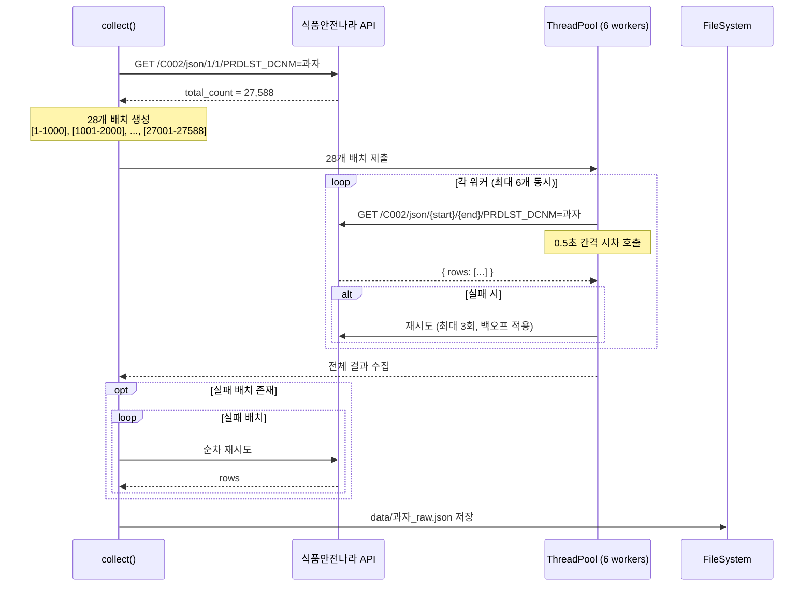

# Food Collector - 식품안전나라 원재료 수집기

## 개요

식품안전나라 OpenAPI(C002)에서 **식품 품목별 원재료 데이터**를 수집하는 배치 수집기.  
동기 배치 + ThreadPoolExecutor(CPU 절반) 기반으로 안정적으로 데이터를 수집한다.

## 아키텍처

```
                        ┌─────────────────────────────┐
                        │        collect()             │
                        │   - 엔트리포인트              │
                        │   - 전체 흐름 제어             │
                        └──────────────┬──────────────┘
                                       │
                          ┌────────────▼────────────┐
                          │   _get_total_count()     │
                          │   API 1건 조회 → 총 건수   │
                          │   (예: 27,588건)          │
                          └────────────┬────────────┘
                                       │
                              배치 분할 (1,000건 단위)
                              총 28개 배치 생성
                                       │
                 ┌─────────────────────▼─────────────────────┐
                 │         ThreadPoolExecutor                 │
                 │         max_workers = CPU // 2 (6개)       │
                 │                                            │
                 │  ┌─────────┐ ┌─────────┐     ┌─────────┐  │
                 │  │ Worker1 │ │ Worker2 │ ... │ Worker6 │  │
                 │  │ Batch 1 │ │ Batch 2 │     │ Batch 6 │  │
                 │  └────┬────┘ └────┬────┘     └────┬────┘  │
                 │       │           │               │        │
                 │       ▼           ▼               ▼        │
                 │   _fetch_batch() 호출 (각 워커별 순차)       │
                 │   - REQUEST_DELAY 간격으로 시차 호출          │
                 │   - 실패 시 최대 3회 재시도                   │
                 └─────────────────────┬─────────────────────┘
                                       │
                              ┌────────▼────────┐
                              │  실패 배치 있음?  │
                              └───┬─────────┬───┘
                                  │ Yes     │ No
                          ┌───────▼───┐     │
                          │ 순차 재시도 │     │
                          │ (동기)     │     │
                          └───────┬───┘     │
                                  │         │
                              ┌───▼─────────▼───┐
                              │  JSON 파일 저장   │
                              │  data/과자_raw.json│
                              └─────────────────┘
```

## 수집 흐름 (Mermaid)



## API 상세

| 항목 | 값 |
|------|-----|
| 엔드포인트 | `http://openapi.foodsafetykorea.go.kr/api/{key}/C002/json/{start}/{end}` |
| 서비스 | C002 - 식품(첨가물)품목제조보고(원재료) |
| 1회 최대 | 1,000건 |
| 인증키 | `.env` 파일의 `food_api_key` |

### 응답 필드

| 필드 | 설명 |
|------|------|
| `PRDLST_REPORT_NO` | 품목제조번호 (PK) |
| `PRDLST_NM` | 품목명 |
| `PRDLST_DCNM` | 품목유형명 (과자, 빵류 등) |
| `BSSH_NM` | 업소명 |
| `LCNS_NO` | 인허가번호 |
| `PRMS_DT` | 보고일자 |
| `RAWMTRL_NM` | 원재료명 (쉼표 구분) |
| `RAWMTRL_ORDNO` | 원재료 표시순서 |
| `CHNG_DT` | 변경일자 (YYYYMMDD) |
| `ETQTY_XPORT_PRDLST_YN` | 내수/겸용 구분 (N:내수, O:겸용) |

### 에러 코드

| 코드 | 의미 |
|------|------|
| `INFO-000` | 정상 |
| `INFO-200` | 데이터 없음 |
| `INFO-100` | 인증키 무효 |
| `ERROR-336` | 1회 요청 1,000건 초과 |
| `INFO-300` | 일일 호출 한도 초과 |

## 설정값

```
BASE_URL       = http://openapi.foodsafetykorea.go.kr/api
SERVICE_ID     = C002
BATCH_SIZE     = 1,000건
MAX_RETRIES    = 3회
RETRY_DELAY    = 2.0초 (시도마다 * attempt 백오프)
REQUEST_DELAY  = 0.5초 (워커 간 시차)
max_workers    = os.cpu_count() // 2
```

## 실행

```bash
uv run python -m src.collector.food_collector
```

## 출력

```
[수집 시작] 카테고리: 과자 | 총 27,588건 | 배치 크기: 1000
[설정] 워커 수: 6 (CPU 12개의 절반)
  [완료] 배치      1-  1000 | 1000건 수집
  [완료] 배치   1001-  2000 | 1000건 수집
  ...
[수집 완료] 예상: 27,588건 | 수집: 27,588건
[성공] 모든 배치 수집 완료
[저장] data/과자_raw.json
```

## 디렉토리 구조

```
snack/
├── .env                          # food_api_key 설정
├── pyproject.toml
├── data/
│   └── 과자_raw.json              # 수집 결과 (gitignore 권장)
└── src/
    └── collector/
        ├── __init__.py
        ├── food_collector.py      # 수집 로직
        └── README.md              # 이 문서
```
